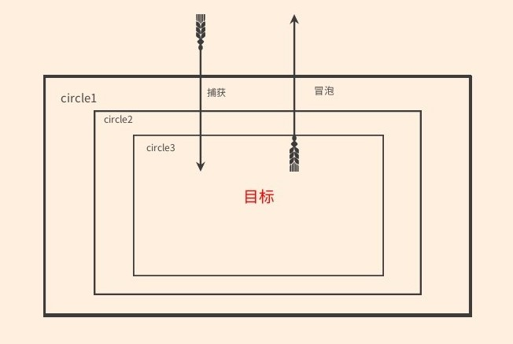

## 1.事件流
事件发生时会在元素节点与根节点之间按照特定的顺序传播，路径所经过的所有节点都会收到该事件，这个传播过程即DOM事件流。事件流分为3个阶段：
- 事件捕获阶段
- 处于目标阶段
- 冒泡阶段
    因为处于目标阶段也被认为是冒泡阶段的一部分，所以我们着重讲解捕获与冒泡
## 2.捕获与冒泡
<br/>
    在前篇中讲到了addEventListener的第三个参数指定事件是否在捕获或冒泡阶段执行，设置为true表示在捕获阶段执行，设置为false则在冒泡阶段执行。咱们来看一段代码：
```html
        <div id="circle1">
            <div id="circle2">
                <div id="circle3"></div>
            </div>
        </div>
        <script>
            let circle1=document.querySelector("#circle1"),circle2=document.querySelector("#circle2"),
            circle3=document.querySelector("#circle3")
            //代码段一：点击circle3，输出的顺序是--circle3,circle2,circle1
            circle1.addEventListener("click",function(){
                console.log("我是circle1")
            },false)
            circle2.addEventListener("click",function(){
                console.log("我是circle2")
            },false)
            circle3.addEventListener("click",function(){
                console.log("我是circle3")
            },false)
            //代码段二：点击circle3，输出的顺序是--circle1,circle2,circle3
            /* circle1.addEventListener("click",function(){
                console.log("我是circle1")
            },true)
            circle2.addEventListener("click",function(){
                console.log("我是circle2")
            },true)
            circle3.addEventListener("click",function(){
                console.log("我是circle3")
            },true) */
        </script>
```

根据上述代码执行结果，我们很容易分辨出捕获与冒泡的区别。我们当时很纯粹的点击了<strong>circle3</strong>,但是'circle2'跟'cirlce3'都输出了，这跟我们的需求并不相符，那么我们怎么阻止事件的冒泡，话不多说，直接上代码：

```typescript
    circle3.addEventListener("click",function(e){
        console.log("我是circle3")
        //非IE浏览器
        e.stopPropagation()
        //IE浏览器
        // window.event.cancelBubble
    },false)
```

## 3.阻止默认事件以及其它相同事件侦听器

有的时候，我们想要取消的事件默认操作，比如a标签跳转和表单自动提交，这时我们可以用<strong>preventDefault</strong>，代码如下：
```html
    <a href="www.baidu.com" id="go">跳转到百度</a>
    <script>
        let go=document.querySelect("go")
        function goFn(e){
            e.preventDefault()
            console.log("我是没法跳转的")
        }
        go.addEventListener('click',goFn,false)
        go.addEventListener('click',function(){
            console.log("我会被执行")
        },false)
    </script>
```
但是啊，凡是总有例外，在IE里面，9之前的浏览器需要设置returnValue属性为false来实现。如下：
```javascript
    function goFn(e){
        let event=e|| window.event

        if(event.preventDefault){
            event.preventDefault();
        }else{
            event.returnValue=false
        }
        console.log("不会跳转的")
    }
```
从上述代码结果可知，不管怎样，这个只能阻止默认行为，如果有多个相同类型事件的事件监听函数绑定到同一个元素，当该类型的事件触发时，它们会按照被添加的顺序执行。如果其中某个监听函数执行了 event.stopImmediatePropagation() 方法，则当前元素剩下的监听函数将不会被执行。
```javascript
    go.addEventListener('click',function(e){
        e.stopImmediatePropagation()
        console.log("执行")
    },false)
    go.addEventListener('click',function(){
        console.log("并不会执行")
    },false)
```