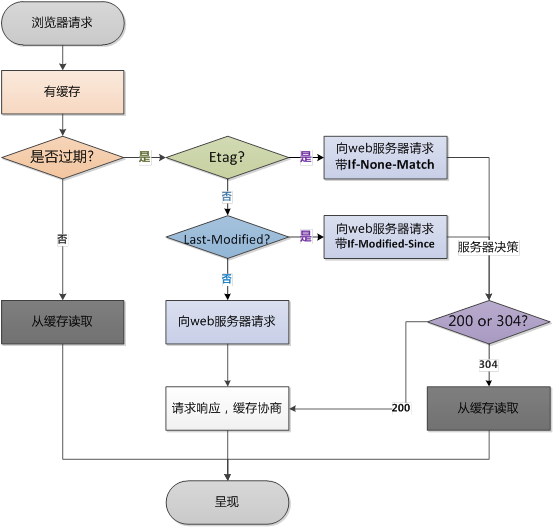

## 1.缓存概述
啥也不说了，直接上一张盗图，清晰明了。 

## 2.缓存分类

### 1. HTTP缓存
    HTTP缓存都是从第二次请求开始的。第一次请求资源时，服务器返回资源，并在response header头中回传资源的缓存参数；第二次请求是，浏览器判断这些请求参数，击中强缓存就直接200，否则就把请求参数加到request header头中传给服务器，看是否击中协商缓存，击中则返回304，否则服务器会返回新的资源。

注意：强缓存的200分为两种，<b>from memory cache</b>和<b>from disk cache</b>，这两种方式只能缓存派生资源。但是，前者从内存中读取缓存，只要杀死进程后，数据将不存在；而后者却是从磁盘中读取缓存，即使杀死进程，数据依然存在。

##### 第二次请求

##### 流程图

#### 1.1强缓存
 名称| 可选值 | 优先级 | 优缺点
 :-:| :-: | :-: | :-:
 Pragma | no-cache:不直接使用缓存，开始服务器新鲜度判定 | 中 | 已废弃 
 Cache-Control | max-age:xx秒：相对时间，强缓存必备;no-cache:不直接使用缓存，开始服务器新鲜度判定；no-store:每次都下载最新资源；public/private:是否只能被单个用户保存 | 高 | 无
 Expires | GMT时间 | 低 | 服务器时间和本地时间不一定统一

#### 1.2协商缓存
名称| 可选值 | 优先级 | 优缺点
:-:| :-: | :-: | :-:
Last-Modify/If-Modify-Since | GMT | 依次比较，排序靠后 | 1.修改并不意味着改变;2.秒级判断
ETag/IF-Node-Match | 校验值 | 依次比较,先比较 | 使用系统默认的Hash算法，在分布式部署中会导致不同服务器的ETag值不一致。

 